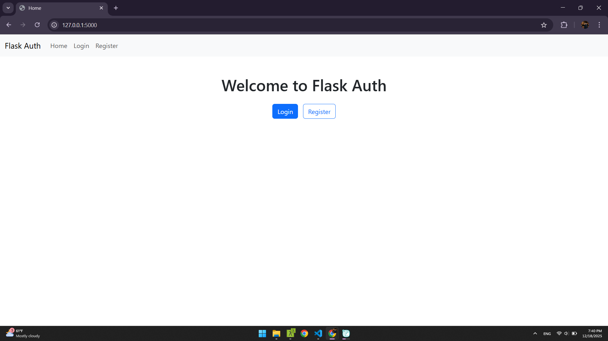
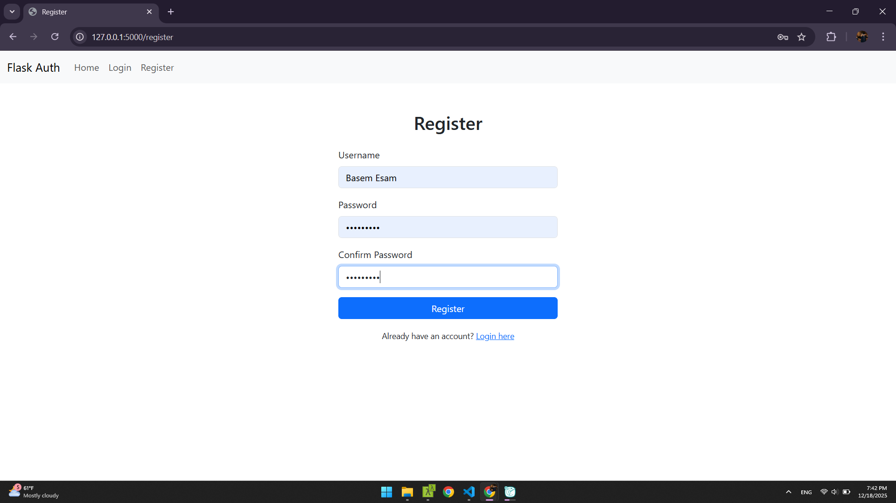
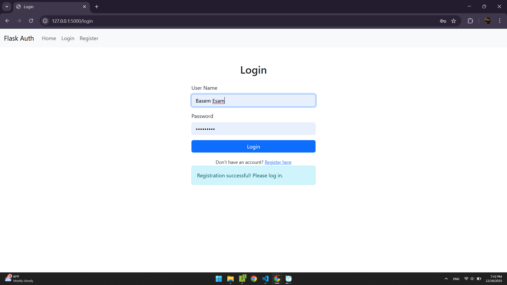
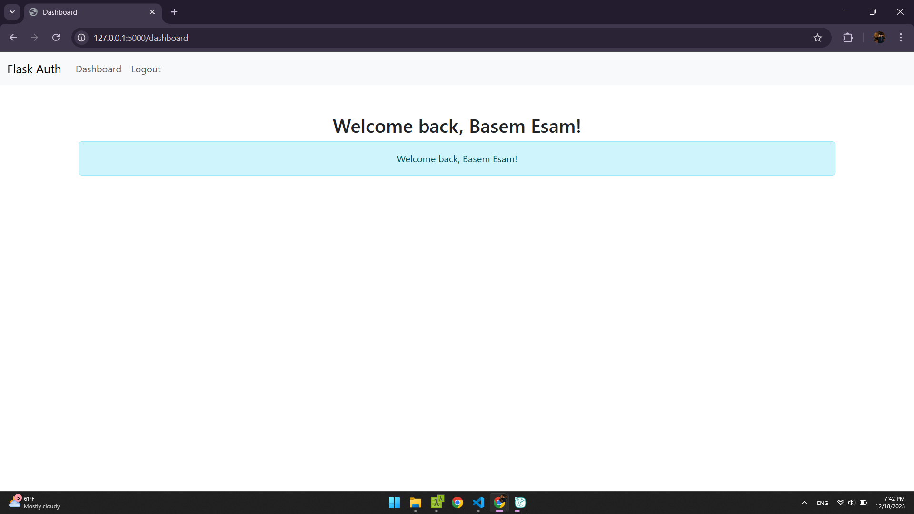

# Flask Authentication System 🔐

A simple and secure Flask-based user authentication system with registration, login, and session management capabilities.

## Features ✨

- User Registration with validation
- Secure Login system
- Password hashing with bcrypt
- Session management
- Protected dashboard route
- User-friendly flash messages
- SQLite database integration

## Tech Stack 🛠️

- **Backend:** Flask (Python)
- **Database:** SQLite
- **Password Hashing:** bcrypt
- **Session Management:** Flask sessions

## Installation 📦

### Prerequisites
- Python 3.7 or higher
- pip (Python package manager)

### Setup

1. **Clone the repository**
```bash
   git clone https://github.com/YOUR_USERNAME/flask-auth-system.git
   cd flask-auth-system
```

2. **Create a virtual environment**
```bash
   # Windows
   python -m venv venv
   venv\Scripts\activate

   # macOS/Linux
   python3 -m venv venv
   source venv/bin/activate
```

3. **Install dependencies**
```bash
   pip install -r requirements.txt
```

4. **Run the application**
```bash
   python app.py
```

5. **Access the application**
```
   Open your browser and navigate to: http://127.0.0.1:5000
```

## Usage 🚀

### Registration
1. Navigate to `/register`
2. Enter a username and password (minimum 8 characters)
3. Confirm your password
4. Click "Register"

### Login
1. Navigate to `/login`
2. Enter your credentials
3. Access your dashboard upon successful login

### Dashboard
- Protected route accessible only to logged-in users
- Displays user information
- Logout functionality

## Project Structure 📁
```
flask-auth-system/
│
├── app.py                 # Main application file
├── requirements.txt       # Python dependencies
├── users.db              # SQLite database (auto-generated)
│
├── templates/
│   ├── home.html         # Landing page
│   ├── login.html        # Login form
│   ├── register.html     # Registration form
│   └── dashboard.html    # User dashboard
│
└── static/
    └── style.css         # CSS styling (optional)
```

## Security Features 🔒

- ✅ Password hashing with bcrypt
- ✅ Parameterized SQL queries (SQL injection prevention)
- ✅ Session-based authentication
- ✅ Login required decorator for protected routes
- ✅ Password confirmation validation
- ✅ Username uniqueness validation

## API Endpoints 🌐

| Route | Method | Description | Authentication |
|-------|--------|-------------|----------------|
| `/` | GET | Home page | No |
| `/register` | GET, POST | User registration | No |
| `/login` | GET, POST | User login | No |
| `/dashboard` | GET | User dashboard | Required |
| `/logout` | GET | User logout | Required |

## Configuration ⚙️

### Environment Variables (Recommended for Production)

Create a `.env` file:
```env
SECRET_KEY=your-secret-key-here
DATABASE_URL=sqlite:///users.db
FLASK_ENV=development
```

Update `app.py`:
```python
import os
from dotenv import load_dotenv

load_dotenv()
app.secret_key = os.environ.get('SECRET_KEY')
```

## Development Roadmap 🗺️

- [x] Basic authentication system
- [x] Bcrypt password hashing
- [ ] Password reset functionality
- [ ] Email verification
- [ ] Rate limiting
- [ ] CSRF protection
- [ ] OAuth integration (Google, GitHub)
- [ ] Profile management
- [ ] Remember me functionality

## Version History 📌

### v2.0 - Bcrypt Integration (Current)
- Added bcrypt password hashing
- Enhanced security measures
- Improved password validation

### v1.0 - Initial Release
- Basic authentication system
- User registration and login
- Session management

## Contributing 🤝

Contributions are welcome! Please follow these steps:

1. Fork the repository
2. Create a new branch (`git checkout -b feature/improvement`)
3. Make your changes
4. Commit your changes (`git commit -am 'Add new feature'`)
5. Push to the branch (`git push origin feature/improvement`)
6. Create a Pull Request

## Known Issues ⚠️

- Secret key is hardcoded (should use environment variables in production)
- No rate limiting (vulnerable to brute force attacks)
- No CSRF protection
- No email verification

## License 📄

This project is licensed under the MIT License - see the [LICENSE](LICENSE) file for details.

## Author ✍️

**Your Name**
- GitHub: [@yourusername](https://github.com/yourusername)
- Email: your.email@example.com

## Acknowledgments 🙏

- Flask documentation
- bcrypt library
- SQLite database

## Support 💬

If you encounter any issues or have questions:
- Open an issue on GitHub
- Contact: your.email@example.com

## Screenshots 📸

### Home Page


### Register Page


### Login Page


### Dashboard


---

**⭐ Star this repository if you find it helpful!**